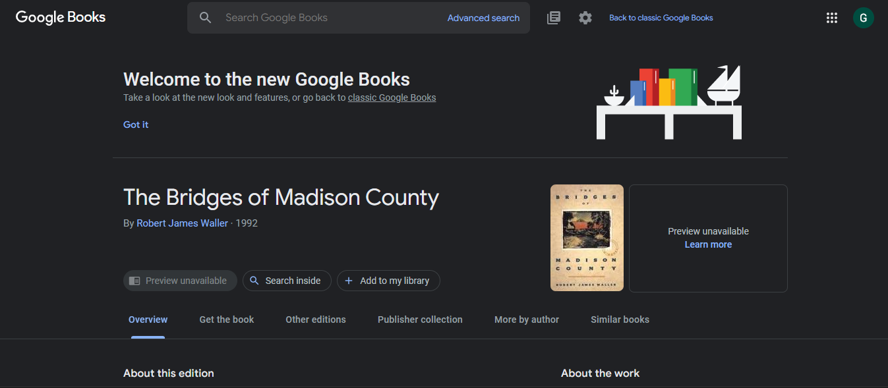

<h1 align="center" id="title">Library management</h1>

Simple library management page where users can be able to see the list of books by searching.Google api is used to search the books based on author / subject / title / publish date.Pages will be loaded when scrolling the website.

<h2>🚀 Demo</h2>

[https://shimmering-pony-a985d8.netlify.app/](https://shimmering-pony-a985d8.netlify.app/)

<h2>Project Screenshots:</h2>

  
  
<h2>🧐 Features</h2>

Here're some of the project's best features:

*   Pagination - 10 books per page
*   Search by Author name / Title / Subject / Publish date
*   Auto loading of books while scrolling
*   Sort by Author name / Title / Subject / Publish date
*   Search count also added from result

  
  
<h2>💻 Built with</h2>

Technologies used in the project:

*   HTML
*   CSS
*   JAVA SCRIPT
*   GOOGLE API
